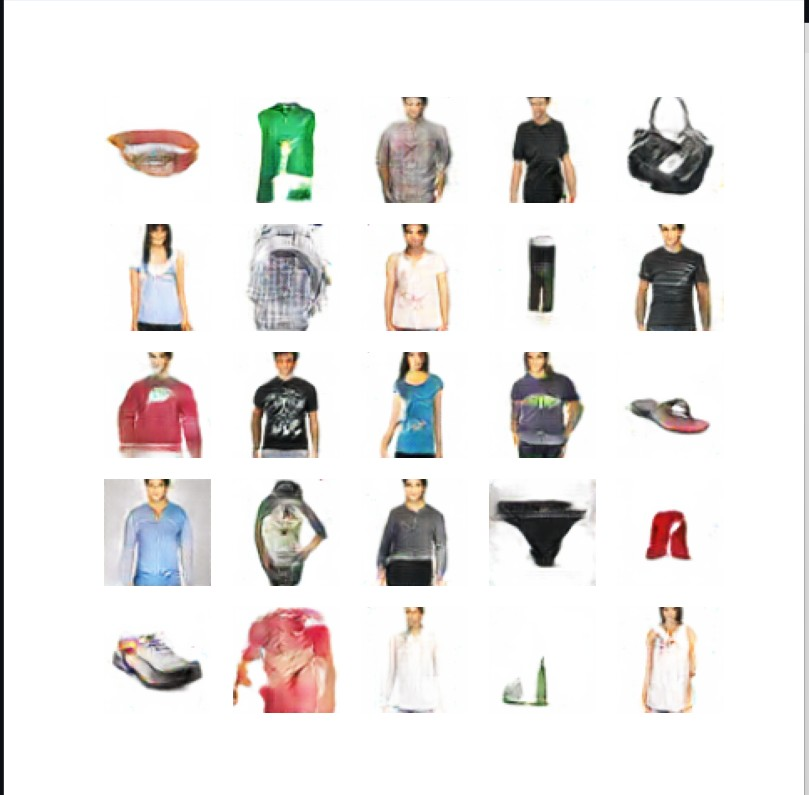

<p align=center>

</p>

<p align=center>
<a target="badge" href="https://github.com/NicoLiao/Pixiv-Downloader" title="python version"></a>
<a target="badge" href="https://github.com/NicoLiao/Pixiv-Downloader" title="windows badge"></a>  
</p>

>This is a software to classify anime characters. User can upload a picture of an anime character and the software will predict which character it is.

All data comes from https://www.kaggle.com/datasets/mylesoneill/tagged-anime-illustrations

# Install
## Release 
Download exe as follow: https://github.com/NicoLiao/Anime-character-predictor/releases/


## Download source code
In order to use Anime character predictor, make sure that you have python 3.10.12 and python packages as below:

* pytorch 2.0.1+cu117
* numpy 1.24.1
* matplotlib 3.7.2

```
$ git clone https://github.com/NicoLiao/Anime-character-predictor
```
## Usage
### Visual Studio Code
Download VSCode https://code.visualstudio.com/

Download python https://www.python.org/

After installing VScode and Python, download the extension in VSCode as follow:
* python
* python for vscode
* code runner

Done it and Run code

### Build exe
Using terminal and pyinstaller to build exe
```
$ pyinstaller -F --noconsole GUI.py 
```
